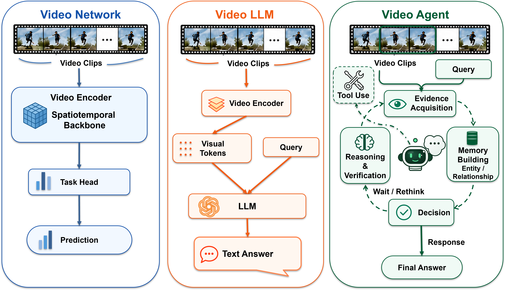
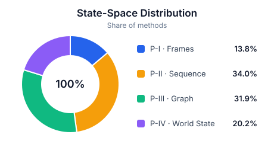
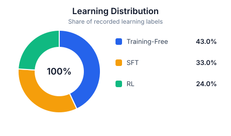
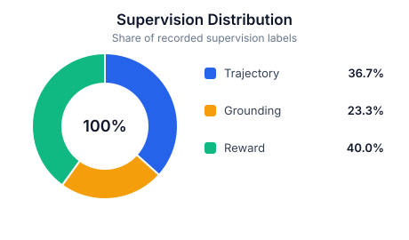

[](https://awesome.re)

# 🎬 Agentic Video Understanding: A Survey

|  |
|:--:|
| **From passive video processing to adaptive action control.** |

This repository accompanies the survey paper **"Agentic Video Understanding: A Survey"** and tracks research on video understanding agents: systems that use video as their primary evidence source and adaptively select actions that change evidence access, internal state, tool use, interaction, or termination.

The survey traces the transition from recognition-centered video networks and fixed-inference Video LLMs to agents that can inspect video segments, acquire missing evidence, maintain task-relevant state, invoke tools, coordinate specialized roles, and decide when to respond.

## Contributions

1. **Definition and scope.** We formally define video understanding agents through adaptive state construction and action selection, distinguishing them from Video LLMs with fixed sampling and one-pass decoding.
2. **Challenge-to-design taxonomy.** We connect context bottlenecks, evidence sparsity, temporal causality, and multimodal ambiguity to the agentic mechanisms required to address them.
3. **State-space taxonomy.** We organize operative video states as a bag of frames, a temporal sequence, a graph of entities, or an evolving world state.
4. **Learning and supervision.** We consolidate training-free control, supervised imitation, reinforcement learning, trajectory supervision, grounding supervision, and preference or reward signals.

## Citation

If you find this survey useful, please cite:

```bibtex
@article{deng2026agenticvideo,
  title   = {Agentic Video Understanding: A Survey},
  author  = {Xinyu Deng and Siwen Luo and Daochang Liu},
  journal = {Manuscript},
  year    = {2026}
}
```

## Table of Contents

- [**0. Scope**](#0-scope)
  - [Related Surveys](#related-surveys)
  - [Adjacent Agentic Areas](#adjacent-agentic-areas)
- [**1. Challenge-to-Design Taxonomy**](#1-challenge-to-design-taxonomy)
  - [Context Bottleneck](#context-bottleneck)
  - [Evidence Sparsity](#evidence-sparsity)
  - [Temporal Causality](#temporal-causality)
  - [Multimodal Ambiguity](#multimodal-ambiguity)
- [**2. State-Space Paradigms**](#2-state-space-paradigms)
- [**3. Learning Paradigms**](#3-learning-paradigms)
- [**4. Data and Supervision**](#4-data-and-supervision)
  - [Complete Taxonomy Matrix](#complete-taxonomy-matrix)
- [**5. Benchmarks**](#5-benchmarks)
  - [Capability-Oriented Benchmarks](#capability-oriented-benchmarks)
  - [Agent-Oriented Benchmarks](#agent-oriented-benchmarks)

# 0. Scope

A **video understanding agent** uses video as its primary source and solves a task through adaptive evidence-state construction and action selection. It must select at least one action that changes subsequent evidence access, state update, tool use, interaction, or termination.

> Papers are ordered chronologically within each section. Core video-agent papers appear exactly once under their primary challenge. Orthogonal dimensions are represented through tags and linked indexes rather than duplicated metadata rows.

### Related Surveys

Surveys are limited to work that directly overlaps video-language understanding, long or streaming video, and the learning or memory mechanisms used by video agents.

> In chronological order, from the earliest to the latest.

| Method | Paper | Venue | arXiv | Web | GitHub |
|:-:|:-|:-:|:-:|:-:|:-:|
| <a id="paper-zou2024seconds"></a>`Long-Video MLLM Survey` | From Seconds to Hours: Reviewing MultiModal Large Language Models on Comprehensive Long Video Understanding | arXiv '24 | [](https://arxiv.org/abs/2409.18938) | - | [](https://github.com/Vincent-ZHQ/Comprehensive-Long-Video-Understanding-Survey) |
| <a id="paper-madan2024foundation"></a>`Video Foundation Models` | Foundation models for video understanding: A survey | arXiv '24 | [](https://arxiv.org/abs/2405.03770) | - | [](https://github.com/NeeluMadan/ViFM_Survey.git) |
| <a id="paper-nguyen2024video"></a>`Video-LLM Survey` | Video-language understanding: A survey from model architecture, model training, and data perspectives | ACL '24 | [](https://arxiv.org/abs/2406.05615) | - | [](https://github.com/nguyentthong/video-language-understanding) |
| <a id="paper-liu2025trainingfree"></a>`Training-Free LVU Survey` | Towards Training-Free Long Video Understanding: Methods, Benchmarks, and Open Challenges | Vicinagearth '25 | - | [](https://link.springer.com/article/10.1007/s44336-025-00017-w) | - |
| <a id="paper-tang2025video"></a>`Video Understanding Survey` | Video understanding with large language models: A survey | IEEE Transactions on Circuits and Systems for Video Technology '25 | [](https://arxiv.org/abs/2312.17432) | - | [](https://github.com/yunlong10/Awesome-LLMs-for-Video-Understanding) |
| <a id="paper-tang2025posttraining"></a>`Video-LMM Post-Training Survey` | Video-LMM Post-Training: A Deep Dive into Video Reasoning with Large Multimodal Models | arXiv '25 | [](https://arxiv.org/abs/2510.05034) | - | [](https://github.com/yunlong10/Awesome-Video-LMM-Post-Training) |
| <a id="paper-meng2026watch"></a>`Human-View Video Survey` | Watch, Remember, Reason: Human-View Video Understanding with MLLMs | arXiv '26 | [](https://arxiv.org/abs/2606.07433) | - | [](https://github.com/marinero4972/Awesome-HumanView-VideoUnderstanding) |
| <a id="paper-li2026streamingsurvey"></a>`Streaming Video Survey` | How to Respond, How to Memorize, How to Be Fast: A Survey of Streaming Video Understanding | SSRN '26 | - | [](https://papers.ssrn.com/sol3/papers.cfm?abstract_id=7008298) | - |


### Adjacent Agentic Areas

The survey discusses the following works as neighboring agentic applications, but does not assign them a challenge, state-space paradigm, learning regime, or supervision label. They therefore remain outside the canonical taxonomy tables; once an explicit taxonomy assignment is added to the survey source, the generator will place them only in the corresponding Challenge-to-Design table.

> In chronological order, from the earliest to the latest.

| Method | Paper | Venue | arXiv | Web | GitHub |
|:-:|:-|:-:|:-:|:-:|:-:|
| <a id="paper-wang2024lave"></a>`LAVE` | Lave: Llm-powered agent assistance and language augmentation for video editing | Proceedings of the 29th International Conference on Intelligent User Interfaces '24 | [](https://arxiv.org/abs/2402.10294) | - | - |
| <a id="paper-tu2026spagent"></a>`SPAgent` | Spagent: Adaptive task decomposition and model selection for general video generation and editing | IEEE Transactions on Image Processing '26 | [](https://arxiv.org/abs/2411.18983) | - | - |


# 1. Challenge-to-Design Taxonomy

The primary paper catalog uses the survey's challenge-to-design taxonomy. Each core method has one canonical placement; paradigm, learning, and supervision dimensions are shown as tags.

### Context Bottleneck

Long, streaming, and multi-source videos exceed practical context and compute budgets. Hierarchical evidence memory retains compact, addressable, and provenance-aware video evidence.

> In chronological order, from the earliest to the latest.

| Method | Paper | Venue | arXiv | Web | GitHub |
|:-:|:-|:-:|:-:|:-:|:-:|
| <a id="paper-fan2024videoagent"></a>`VideoAgent (Fan et al.)`<br><sub>P-III · Training-Free</sub> | Videoagent: A memory-augmented multimodal agent for video understanding | ECCV '24 | [](https://arxiv.org/abs/2403.11481) | [](https://videoagent.github.io) | - |
| <a id="paper-qian2024streaming"></a>`VideoStreaming`<br><sub>P-IV · SFT · Grounding supervision</sub> | Streaming long video understanding with large language models | NeurIPS '24 | [](https://arxiv.org/abs/2405.16009) | - | - |
| <a id="paper-zhang2026adavideorag"></a>`AdaVideoRAG`<br><sub>P-III · Training-Free</sub> | AdaVideoRAG: Omni-Contextual Adaptive Retrieval-Augmented Efficient Long Video Understanding | NeurIPS '25 | [](https://arxiv.org/abs/2506.13589) | - | [](https://github.com/xzc-zju/AdaVideoRAG) |
| <a id="paper-gao2025agentic"></a>`AVI`<br><sub>P-III · Training-Free</sub> | Agentic Video Intelligence: A Flexible Framework for Advanced Video Exploration and Understanding | arXiv '25 | [](https://arxiv.org/abs/2511.14446) | - | - |
| <a id="paper-ma2025drvideo"></a>`DrVideo`<br><sub>P-III · Training-Free</sub> | Drvideo: Document retrieval based long video understanding | CVPR '25 | [](https://arxiv.org/abs/2406.12846) | - | [](https://github.com/Upper9527/DrVideo) |
| <a id="paper-zhang2025flash"></a>`Flash-VStream`<br><sub>P-III · Unspecified learning</sub> | Flash-vstream: Efficient real-time understanding for long video streams | ICCV '25 | [](https://arxiv.org/abs/2506.23825) | - | [](https://github.com/IVGSZ/Flash-VStream) |
| <a id="paper-long2025seeing"></a>`M3-Agent`<br><sub>P-III · SFT · RL · Grounding supervision · Reward supervision</sub> | Seeing, listening, remembering, and reasoning: A multimodal agent with long-term memory | arXiv '25 | [](https://arxiv.org/abs/2508.09736) | [](https://m3-agent.github.io) | [](https://github.com/bytedance-seed/m3-agent) |
| <a id="paper-pang2025mr"></a>`Mr. Video`<br><sub>P-III · Training-Free</sub> | Mr. video:" mapreduce" is the principle for long video understanding | arXiv '25 | [](https://arxiv.org/abs/2504.16082) | - | [](https://github.com/ziqipang/MR-Video) |
| <a id="paper-chatterjee2025memory"></a>`ProVideLLM`<br><sub>P-IV · Unspecified learning</sub> | Memory-efficient streaming videollms for real-time procedural video understanding | arXiv '25 | [](https://arxiv.org/abs/2504.13915) | [](https://dibschat.github.io/ProVideLLM) | [](https://github.com/dibschat/ProVideLLM) |
| <a id="paper-di2025streaming"></a>`ReKV`<br><sub>P-III · Unspecified learning</sub> | Streaming video question-answering with in-context video kv-cache retrieval | ICLR '25 | [](https://arxiv.org/abs/2503.00540) | - | [](https://github.com/Becomebright/ReKV) |
| <a id="paper-xiong2025streaming"></a>`StreamChat`<br><sub>P-III · Training-Free</sub> | Streaming video understanding and multi-round interaction with memory-enhanced knowledge | arXiv '25 | [](https://arxiv.org/abs/2501.13468) | - | [](https://github.com/hmxiong/StreamChat) |
| <a id="paper-luo2026video"></a>`Video-RAG`<br><sub>P-III · Training-Free</sub> | Video-rag: Visually-aligned retrieval-augmented long video comprehension | NeurIPS '25 | [](https://arxiv.org/abs/2411.13093) | - | [](https://github.com/Leon1207/Video-RAG-master) |
| <a id="paper-wang2025videollamb"></a>`VideoLLaMB`<br><sub>P-III · Unspecified learning</sub> | Videollamb: Long streaming video understanding with recurrent memory bridges | ICCV '25 | [](https://arxiv.org/abs/2409.01071) | - | [](https://github.com/bigai-nlco/VideoLLaMB) |
| <a id="paper-zuo2026videolucy"></a>`VideoLucy`<br><sub>P-III · Training-Free</sub> | Videolucy: Deep memory backtracking for long video understanding | NeurIPS '25 | [](https://arxiv.org/abs/2510.12422) | [](https://videolucy.github.io) | [](https://github.com/worldbench/VideoLucy) |
| <a id="paper-yang2026graph"></a>`G2F-RAG`<br><sub>P-III · Training-Free</sub> | Graph-to-Frame RAG: Visual-Space Knowledge Fusion for Training-Free and Auditable Video Reasoning | CVPR '26 | [](https://arxiv.org/abs/2604.04372) | - | - |
| <a id="paper-yin2026hierarchical"></a>`HAVEN`<br><sub>P-III · Training-Free</sub> | Hierarchical Long Video Understanding with Audiovisual Entity Cohesion and Agentic Search | arXiv '26 | [](https://arxiv.org/abs/2601.13719) | - | - |
| <a id="paper-liu2026efficient"></a>`R3-Streaming`<br><sub>P-IV · RL · Reward supervision</sub> | An Efficient Streaming Video Understanding Framework with Agentic Control | arXiv '26 | [](https://arxiv.org/abs/2605.17921) | - | - |
| <a id="paper-wang2026streammeco"></a>`StreamMeCo`<br><sub>P-III · Training-Free</sub> | Streammeco: Long-term agent memory compression for efficient streaming video understanding | ACL '26 | [](https://arxiv.org/abs/2604.09000) | - | [](https://github.com/Celina-love-sweet/StreamMeCo) |
| <a id="paper-xie2026streamrag"></a>`StreamRAG`<br><sub>P-III · Training-Free</sub> | StreamRAG: Enhancing Real-Time Video Understanding with Retrieval Augmentation | CVPR '26 | - | [](https://openaccess.thecvf.com/content/CVPR2026/html/Xie_StreamRAG_Enhancing_Real-Time_Video_Understanding_with_Retrieval_Augmentation_CVPR_2026_paper.html) | - |
| <a id="paper-yin2026videoarm"></a>`VideoARM`<br><sub>P-III · Training-Free</sub> | Videoarm: Agentic reasoning over hierarchical memory for long-form video understanding | CVPR '26 | [](https://arxiv.org/abs/2512.12360) | [](https://milvlg.github.io/videoarm) | [](https://github.com/MILVLG/videoarm) |
| <a id="paper-yeo2026worldmm"></a>`WorldMM`<br><sub>P-III · Training-Free</sub> | Worldmm: Dynamic multimodal memory agent for long video reasoning | CVPR '26 | [](https://arxiv.org/abs/2512.02425) | [](https://worldmm.github.io) | [](https://github.com/wgcyeo/WorldMM) |


### Evidence Sparsity

Answer-critical evidence is often sparse. Active evidence acquisition lets an agent decide where, when, and at what granularity to inspect video.

> In chronological order, from the earliest to the latest.

| Method | Paper | Venue | arXiv | Web | GitHub |
|:-:|:-|:-:|:-:|:-:|:-:|
| <a id="paper-zhang2024omagent"></a>`OmAgent`<br><sub>P-III · Training-Free</sub> | Omagent: A multi-modal agent framework for complex video understanding with task divide-and-conquer | EMNLP '24 | [](https://arxiv.org/abs/2406.16620) | - | [](https://github.com/om-ai-lab/OmAgent) |
| <a id="paper-kim2025salova"></a>`SALOVA`<br><sub>P-I · Unspecified learning</sub> | Salova: Segment-augmented long video assistant for targeted retrieval and routing in long-form video analysis | CVPR '24 | [](https://arxiv.org/abs/2411.16173) | [](https://ivy-lvlm.github.io/SALOVA) | [](https://github.com/IVY-LVLM/SALOVA) |
| <a id="paper-nie2024slowfocus"></a>`SlowFocus`<br><sub>P-II · Unspecified learning</sub> | Slowfocus: Enhancing fine-grained temporal understanding in video llm | NeurIPS '24 | [](https://arxiv.org/abs/2602.03589) | - | [](https://github.com/fudan-zvg/SlowFocus) |
| <a id="paper-wang2024videoagent"></a>`VideoAgent (Wang et al.)`<br><sub>P-II · Training-Free</sub> | Videoagent: Long-form video understanding with large language model as agent | ECCV '24 | [](https://arxiv.org/abs/2403.10517) | [](https://wxh1996.github.io/VideoAgent-Website) | - |
| <a id="paper-shi2025enhancing"></a>`AoTD`<br><sub>P-II · SFT · Trajectory supervision</sub> | Enhancing video-llm reasoning via agent-of-thoughts distillation | CVPR '25 | [](https://arxiv.org/abs/2412.01694) | [](https://zhengrongz.github.io/AoTD) | - |
| <a id="paper-liu2025commonsense"></a>`Commonsense Video QA`<br><sub>P-II · Training-Free · Grounding supervision</sub> | Commonsense video question answering through video-grounded entailment tree reasoning | CVPR '25 | [](https://arxiv.org/abs/2501.05069) | - | - |
| <a id="paper-zhang2026deep"></a>`DVD`<br><sub>P-III · Training-Free</sub> | Deep video discovery: Agentic search with tool use for long-form video understanding | NeurIPS '25 | [](https://arxiv.org/abs/2505.18079) | - | [](https://github.com/microsoft/DeepVideoDiscovery) |
| <a id="paper-liu2025flow4agent"></a>`Flow4Agent`<br><sub>P-I · Unspecified learning</sub> | Flow4agent: Long-form video understanding via motion prior from optical flow | ICCV '25 | [](https://arxiv.org/abs/2510.05836) | - | - |
| <a id="paper-he2025framethinker"></a>`FrameThinker`<br><sub>P-I · SFT · RL · Trajectory supervision · Reward supervision</sub> | Framethinker: Learning to think with long videos via multi-turn frame spotlighting | arXiv '25 | [](https://arxiv.org/abs/2509.24304) | - | [](https://github.com/lcqysl/FrameThinker-RL) |
| <a id="paper-yang2026longvt"></a>`LongVT`<br><sub>P-II · SFT · RL · Reward supervision</sub> | Longvt: Incentivizing" thinking with long videos" via native tool calling | CVPR '25 | [](https://arxiv.org/abs/2511.20785) | [](https://evolvinglmms-lab.github.io/LongVT) | [](https://github.com/EvolvingLMMs-Lab/LongVT) |
| <a id="paper-lvagent2025"></a>`LVAgent`<br><sub>P-I · Training-Free</sub> | Lvagent: Long video understanding by multi-round dynamical collaboration of mllm agents | ICCV '25 | [](https://arxiv.org/abs/2503.10200) | - | [](https://github.com/64327069/LVAgent) |
| <a id="paper-song2025modularized"></a>`MSR-ViR`<br><sub>P-II · SFT · RL · Grounding supervision · Reward supervision</sub> | Modularized self-reflected video reasoner for multimodal llm with application to video question answering | ICML '25 | - | [](https://proceedings.mlr.press/v267/song25g.html) | [](https://github.com/song-zh19/MSR-ViR) |
| <a id="paper-reagentv2025"></a>`ReAgent-V`<br><sub>P-I · RL · Reward supervision</sub> | Reagent-v: A reward-driven multi-agent framework for video understanding | NeurIPS '25 | [](https://arxiv.org/abs/2506.01300) | - | [](https://github.com/aiming-lab/ReAgent-V) |
| <a id="paper-li2026select"></a>`Select Less, Reason More`<br><sub>P-I · RL · Grounding supervision · Reward supervision</sub> | Select less, reason more: Prioritizing evidence purity for video reasoning | CVPR '25 | [](https://arxiv.org/abs/2510.15440) | - | - |
| <a id="paper-zhang2026thinking"></a>`Thinking with Videos`<br><sub>P-II · RL · Reward supervision</sub> | Thinking with videos: Multimodal tool-augmented reinforcement learning for long video reasoning | CVPR '25 | [](https://arxiv.org/abs/2508.04416) | [](https://zhang9302002.github.io/thinkingwithvideos-page) | [](https://github.com/zhang9302002/ThinkingWithVideos) |
| <a id="paper-yang2025vca"></a>`VCA`<br><sub>P-II · Training-Free</sub> | Vca: Video curious agent for long video understanding | ICCV '25 | [](https://arxiv.org/abs/2412.10471) | - | - |
| <a id="paper-zhi2025videoagent2"></a>`VideoAgent2`<br><sub>P-II · Training-Free</sub> | Videoagent2: Enhancing the llm-based agent system for long-form video understanding by uncertainty-aware cot | arXiv '25 | [](https://arxiv.org/abs/2504.04471) | - | - |
| <a id="paper-yuan2025videoexplorer"></a>`VideoExplorer`<br><sub>P-III · SFT · RL · Trajectory supervision · Reward supervision</sub> | VideoExplorer: Think With Videos For Agentic Long-Video Understanding | arXiv '25 | [](https://arxiv.org/abs/2506.10821) | - | [](https://github.com/yhy-2000/VideoDeepResearch) |
| <a id="paper-a4vl2026"></a>`A4VL`<br><sub>P-I · Training-Free</sub> | A Multi-Agent Perception-Action Alliance for Efficient Long Video Reasoning | CVPR '26 | [](https://arxiv.org/abs/2603.14052) | - | [](https://github.com/git-disl/A4VL) |
| <a id="paper-du2026appo"></a>`APPO`<br><sub>P-I · RL · Reward supervision</sub> | APPO: Attention-guided Perception Policy Optimization for Video Reasoning | CVPR '26 | [](https://arxiv.org/abs/2602.23823) | - | [](https://github.com/GeWu-Lab/APPO) |
| <a id="paper-zhang2026eva"></a>`EVA`<br><sub>P-I · SFT · RL · Reward supervision</sub> | EVA: Efficient Reinforcement Learning for End-to-End Video Agent | CVPR '26 | [](https://arxiv.org/abs/2603.22918) | - | [](https://github.com/wangruohui/EfficientVideoAgent) |
| <a id="paper-li2026lenswalk"></a>`LensWalk`<br><sub>P-II · Training-Free</sub> | LensWalk: Agentic video understanding by planning how you see in videos | CVPR '26 | [](https://arxiv.org/abs/2603.24558) | - | - |
| <a id="paper-qiu2026longvideo"></a>`LongVideo-R1`<br><sub>P-II · SFT · RL · Reward supervision</sub> | Longvideo-r1: Smart navigation for low-cost long video understanding | CVPR '26 | [](https://arxiv.org/abs/2602.20913) | - | [](https://github.com/qiujihao19/LongVideo-R1) |
| <a id="paper-xing2026native"></a>`OmniAgent`<br><sub>P-IV · SFT · RL · Trajectory supervision · Reward supervision</sub> | Native Active Perception as Reasoning for Omni-Modal Understanding | arXiv '26 | [](https://arxiv.org/abs/2606.19341) | [](https://huggingface.co/harryhsing/OmniAgent-RL-7B) | [](https://github.com/harryhsing/OmniAgent) |
| <a id="paper-xu2026towards"></a>`ReViSe`<br><sub>P-I · SFT · RL · Reward supervision</sub> | Towards Sparse Video Understanding and Reasoning | CVPR '26 | [](https://arxiv.org/abs/2602.13602) | [](https://sparsevideounderstanding.github.io) | - |
| <a id="paper-jain2026sage"></a>`SAGE`<br><sub>P-II · RL · Reward supervision</sub> | Sage: Training smart any-horizon agents for long video reasoning with reinforcement learning | CVPR '26 | [](https://arxiv.org/abs/2512.13874) | [](https://praeclarumjj3.github.io/sage) | [](https://github.com/allenai/SAGE) |
| <a id="paper-xie2025video"></a>`Video-MTR`<br><sub>P-II · RL · Reward supervision</sub> | Video-mtr: Reinforced multi-turn reasoning for long video understanding | arXiv '26 | [](https://arxiv.org/abs/2508.20478) | - | [](https://github.com/Xyuan13/Video-MTR) |
| <a id="paper-zou2026videobrain"></a>`VideoBrain`<br><sub>P-I · SFT · RL · Trajectory supervision · Reward supervision</sub> | VideoBrain: Learning Adaptive Frame Sampling for Long Video Understanding | arXiv '26 | [](https://arxiv.org/abs/2602.04094) | - | [](https://github.com/junbo-zou/VideoBrain) |
| <a id="paper-wang2026videochat"></a>`VideoChat-A1`<br><sub>P-II · Training-Free</sub> | Videochat-a1: Thinking with long videos by chain-of-shot reasoning | Proceedings of the AAAI Conference on Artificial Intelligence '26 | [](https://arxiv.org/abs/2506.06097) | - | [](https://github.com/SpXace/VideoChat-A1) |
| <a id="paper-qiu2026videoseal"></a>`VideoSEAL`<br><sub>P-II · RL · Grounding supervision · Reward supervision</sub> | VideoSEAL: Mitigating Evidence Misalignment in Agentic Long Video Understanding by Decoupling Answer Authority | arXiv '26 | [](https://arxiv.org/abs/2605.12571) | - | [](https://github.com/Echochef/VideoSEAL) |
| <a id="paper-lin2026videoseek"></a>`VideoSeek`<br><sub>P-II · Training-Free</sub> | VideoSeek: Long-Horizon Video Agent with Tool-Guided Seeking | CVPR '26 | [](https://arxiv.org/abs/2603.20185) | - | [](https://github.com/jylins/videoseek) |


### Temporal Causality

Video is an ordered record of change. State and process tracking preserve transitions, causal dependencies, and response readiness.

> In chronological order, from the earliest to the latest.

| Method | Paper | Venue | arXiv | Web | GitHub |
|:-:|:-|:-:|:-:|:-:|:-:|
| <a id="paper-yang2024agent"></a>`AVT`<br><sub>P-II · Training-Free</sub> | Agent-based Video Trimming | arXiv '24 | [](https://arxiv.org/abs/2412.09513) | [](https://ylingfeng.github.io/AVT) | - |
| <a id="paper-yang2024doraemongpt"></a>`DoraemonGPT`<br><sub>P-III · Training-Free</sub> | Doraemongpt: Toward understanding dynamic scenes with large language models (exemplified as a video agent) | arXiv '24 | [](https://arxiv.org/abs/2401.08392) | [](https://z-x-yang.github.io/doraemon-gpt) | [](https://github.com/z-x-yang/DoraemonGPT) |
| <a id="paper-pmlr-v235-fei24a"></a>`Video-of-Thought`<br><sub>P-III · Training-Free · SFT · Grounding supervision</sub> | [Video-of-Thought: Step-by-Step Video Reasoning from Perception to Cognition](https://proceedings.mlr.press/v235/fei24a.html) | ICML '24 | [](https://arxiv.org/abs/2501.03230) | [](https://haofei.vip/VoT) | [](https://github.com/scofield7419/Video-of-Thought) |
| <a id="paper-zhang2025avila"></a>`AViLA`<br><sub>P-IV · Training-Free · Grounding supervision</sub> | Avila: Asynchronous vision-language agent for streaming multimodal data interaction | arXiv '25 | [](https://arxiv.org/abs/2506.18472) | - | - |
| <a id="paper-chen2025egoagent"></a>`EgoAgent`<br><sub>P-IV · SFT · Trajectory supervision</sub> | EgoAgent: a joint predictive agent model in egocentric worlds | ICCV '25 | [](https://arxiv.org/abs/2502.05857) | [](https://egoagent.github.io) | [](https://github.com/zju3dv/EgoAgent) |
| <a id="paper-fan2025embodied"></a>`Embodied VideoAgent`<br><sub>P-IV · Training-Free</sub> | Embodied videoagent: Persistent memory from egocentric videos and embodied sensors enables dynamic scene understanding | ICCV '25 | [](https://arxiv.org/abs/2501.00358) | [](https://embodied-videoagent.github.io) | [](https://github.com/Embodied-VideoAgent/embodied-videoagent) |
| <a id="paper-yu2026eyes"></a>`Eyes Wide Open`<br><sub>P-IV · SFT · Trajectory supervision</sub> | Eyes Wide Open: Ego Proactive Video-LLM for Streaming Video | NeurIPS '25 | [](https://arxiv.org/abs/2510.14560) | [](https://zhangyl4.github.io/publications/eyes-wide-open) | - |
| <a id="paper-chu2025graphvideoagent"></a>`GraphVideoAgent`<br><sub>P-III · Training-Free</sub> | GraphVideoAgent: Enhancing Long-form Video Understanding with Entity Relation Graphs | ACM MM '25 | [](https://arxiv.org/abs/2501.15953) | [](https://doi.org/10.1145/3746027.3755537) | - |
| <a id="paper-li2025lion"></a>`LION-FS`<br><sub>P-IV · SFT · Trajectory supervision</sub> | Lion-fs: Fast & slow video-language thinker as online video assistant | CVPR '25 | [](https://arxiv.org/abs/2503.03663) | - | [](https://github.com/JiuTian-VL/LION-FS) |
| <a id="paper-wang2025mobile"></a>`Mobile-Agent-V`<br><sub>P-II · SFT · Trajectory supervision</sub> | Mobile-Agent-V: A Video-Guided Approach for Effortless and Efficient Operational Knowledge Injection in Mobile Automation | arXiv '25 | [](https://arxiv.org/abs/2502.17110) | - | - |
| <a id="paper-jang2025scalable"></a>`MONDAY`<br><sub>P-II · SFT · Trajectory supervision</sub> | Scalable video-to-dataset generation for cross-platform mobile agents | CVPR '25 | [](https://arxiv.org/abs/2505.12632) | [](https://monday-dataset.github.io) | - |
| <a id="paper-yang2026panda"></a>`PANDA`<br><sub>P-IV · Training-Free</sub> | Panda: Towards generalist video anomaly detection via agentic ai engineer | NeurIPS '25 | [](https://arxiv.org/abs/2509.26386) | - | [](https://github.com/showlab/PANDA) |
| <a id="paper-zhang2025rewatch"></a>`ReWatch-R1`<br><sub>P-II · SFT · RL · Trajectory supervision · Grounding supervision · Reward supervision</sub> | ReWatch-R1: Boosting Complex Video Reasoning in Large Vision-Language Models through Agentic Data Synthesis | arXiv '25 | [](https://arxiv.org/abs/2509.23652) | [](https://rewatch-r1.github.io) | [](https://github.com/alibaba/ReWatch-R1) |
| <a id="paper-han2025roomtour3d"></a>`RoomTour3D`<br><sub>P-II · SFT · Trajectory supervision</sub> | Roomtour3d: Geometry-aware video-instruction tuning for embodied navigation | CVPR '25 | [](https://arxiv.org/abs/2412.08591) | [](https://roomtour3d.github.io) | [](https://github.com/roomtour3d/roomtour3d-NaviLLM) |
| <a id="paper-wu2026season"></a>`SEASON`<br><sub>P-II · Training-Free</sub> | Season: Mitigating temporal hallucination in video large language models via self-diagnostic contrastive decoding | CVPR '25 | [](https://arxiv.org/abs/2512.04643) | [](https://chriswu018.github.io/season) | - |
| <a id="paper-wang2026streambridge"></a>`StreamBridge`<br><sub>P-IV · SFT · Trajectory supervision</sub> | Streambridge: Turning your offline video large language model into a proactive streaming assistant | NeurIPS '25 | [](https://arxiv.org/abs/2505.05467) | - | [](https://github.com/apple/ml-streambridge) |
| <a id="paper-wang2026time"></a>`Time-R1`<br><sub>P-II · RL · Reward supervision</sub> | Time-r1: Post-training large vision language model for temporal video grounding | NeurIPS '25 | [](https://arxiv.org/abs/2503.13377) | [](https://xuboshen.github.io/Time-R1) | [](https://github.com/xiaomi-research/Time-R1) |
| <a id="paper-feng2026video"></a>`Video-R1`<br><sub>P-II · RL · Reward supervision</sub> | Video-r1: Reinforcing video reasoning in mllms | NeurIPS '25 | [](https://arxiv.org/abs/2503.21776) | - | [](https://github.com/tulerfeng/Video-R1) |
| <a id="paper-lu2025videoagenttrek"></a>`VideoAgentTrek`<br><sub>P-II · SFT · Trajectory supervision</sub> | VideoAgentTrek: Computer Use Pretraining from Unlabeled Videos | arXiv '25 | [](https://arxiv.org/abs/2510.19488) | [](https://videoagenttrek.github.io) | [](https://github.com/xlang-ai/VideoAgentTrek) |
| <a id="paper-lu2025vited"></a>`VITED`<br><sub>P-II · SFT · Trajectory supervision</sub> | Vited: Video temporal evidence distillation | CVPR '25 | [](https://arxiv.org/abs/2503.12855) | - | - |
| <a id="paper-zhang2025vtimecot"></a>`VTimeCoT`<br><sub>P-III · SFT · Trajectory supervision</sub> | Vtimecot: Thinking by drawing for video temporal grounding and reasoning | ICCV '25 | [](https://arxiv.org/abs/2510.14672) | [](https://vtimecot.github.io) | - |
| <a id="paper-luo2026thinking"></a>`When Thinking Drifts`<br><sub>P-II · RL · Reward supervision</sub> | When thinking drifts: Evidential grounding for robust video reasoning | NeurIPS '25 | [](https://arxiv.org/abs/2510.06077) | [](https://vision.cs.utexas.edu/projects/video-ver) | - |
| <a id="paper-rege2026agentic"></a>`EGAgent`<br><sub>P-III · Training-Free</sub> | Agentic Very Long Video Understanding | arXiv '26 | [](https://arxiv.org/abs/2601.18157) | - | [](https://github.com/facebookresearch/egagent) |
| <a id="paper-yan2026proact"></a>`Proact-VL`<br><sub>P-IV · SFT · Trajectory supervision · Grounding supervision</sub> | Proact-vl: A proactive videollm for real-time ai companions | arXiv '26 | [](https://arxiv.org/abs/2603.03447) | [](https://proact-vl.github.io) | - |
| <a id="paper-jiang2026referagent"></a>`Refer-Agent`<br><sub>P-I · Training-Free · Grounding supervision</sub> | Refer-Agent: A Collaborative Multi-Agent System with Reasoning and Reflection for Referring Video Object Segmentation | arXiv '26 | [](https://arxiv.org/abs/2602.03595) | - | [](https://github.com/iSEE-Laboratory/Refer-Agent) |
| <a id="paper-yang2025streamagent"></a>`StreamAgent`<br><sub>P-IV · SFT · Trajectory supervision</sub> | Streamagent: Towards anticipatory agents for streaming video understanding | arXiv '26 | [](https://arxiv.org/abs/2508.01875) | - | - |
| <a id="paper-yao2026harnessing"></a>`Streaming Harness`<br><sub>P-IV · SFT · Trajectory supervision</sub> | Harnessing Streaming Video in the Wild | arXiv '26 | [](https://arxiv.org/abs/2606.08615) | - | - |
| <a id="paper-azad2026streamready"></a>`StreamReady`<br><sub>P-IV · SFT · Grounding supervision</sub> | Streamready: Learning what to answer and when in long streaming videos | CVPR '26 | [](https://arxiv.org/abs/2603.08620) | [](https://sacrcv.github.io/StreamReady-website) | - |
| <a id="paper-yang2026svagent"></a>`SVAgent`<br><sub>P-III · Training-Free</sub> | SVAgent: Storyline-Guided Long Video Understanding via Cross-Modal Multi-Agent Collaboration | CVPR '26 | [](https://arxiv.org/abs/2604.05079) | - | - |
| <a id="paper-tang2026asynchronous"></a>`Takusen`<br><sub>P-IV · SFT · Trajectory supervision</sub> | Asynchronous Temporal Modeling with Two-Agent Framework for Streaming Dense Video Captioning | CVPR '26 | - | [](https://openaccess.thecvf.com/content/CVPR2026/html/Tang_Asynchronous_Temporal_Modeling_with_Two-Agent_Framework_for_Streaming_Dense_Video_CVPR_2026_paper.html) | - |
| <a id="paper-liu2026thinking"></a>`ThinkStream`<br><sub>P-IV · RL · Reward supervision</sub> | Thinking in streaming video | arXiv '26 | [](https://arxiv.org/abs/2603.12938) | - | [](https://github.com/johncaged/ThinkStream) |
| <a id="paper-wang2026think"></a>`VideoHV-Agent`<br><sub>P-II · Training-Free · Grounding supervision</sub> | Think, Then Verify: A Hypothesis-Verification Multi-Agent Framework for Long Video Understanding | CVPR '26 | [](https://arxiv.org/abs/2603.04977) | - | [](https://github.com/Haorane/VideoHV-Agent) |
| <a id="paper-liu2025videomind"></a>`VideoMind`<br><sub>P-III · SFT · Grounding supervision</sub> | VideoMind: A Chain-of-LoRA Agent for Temporal-Grounded Video Reasoning | NeurIPS 2025 Workshop on Bridging Language, Agent, and World Models for Reasoning and Planning '26 | [](https://arxiv.org/abs/2503.13444) | [](https://videomind.github.io) | [](https://github.com/yeliudev/VideoMind) |


### Multimodal Ambiguity

Vision, speech, audio, OCR, motion, and interaction cues may conflict. Role-specialized coordination separates and reconciles heterogeneous evidence.

> In chronological order, from the earliest to the latest.

| Method | Paper | Venue | arXiv | Web | GitHub |
|:-:|:-|:-:|:-:|:-:|:-:|
| <a id="paper-zhang2024internlm"></a>`IXC2.5-OL`<br><sub>P-IV · Training-Free</sub> | Internlm-xcomposer2. 5-omnilive: A comprehensive multimodal system for long-term streaming video and audio interactions | arXiv '24 | [](https://arxiv.org/abs/2412.09596) | - | [](https://github.com/InternLM/InternLM-XComposer/tree/main/InternLM-XComposer-2.5-OmniLive) |
| <a id="paper-chowdhury2026magnet"></a>`MAGNET`<br><sub>P-III · Training-Free</sub> | Magnet: A multi-agent framework for finding audio-visual needles by reasoning over multi-video haystacks | NeurIPS '25 | [](https://arxiv.org/abs/2506.07016) | [](https://schowdhury671.github.io/magnet_project) | - |
| <a id="paper-chen2025multimodal"></a>`MAViD`<br><sub>P-II · SFT</sub> | A Multimodal Video Understanding Agent Based on Video-Audio Multi-Task Joint Fine-Tuning and State Machine Scheduling | Proceedings of the 2025 8th International Conference on Computer Information Science and Artificial Intelligence '25 | - | [](https://doi.org/10.1145/3773365.3773429) | - |
| <a id="paper-xu2026scieducator"></a>`SciEducator`<br><sub>P-III · Training-Free</sub> | SciEducator: Scientific Video Understanding and Educating via Deming-Cycle Multi-Agent System | CVPR '25 | [](https://arxiv.org/abs/2511.17943) | - | - |
| <a id="paper-fu2025vispeak"></a>`ViSpeak`<br><sub>P-IV · SFT · Trajectory supervision</sub> | Vispeak: Visual instruction feedback in streaming videos | ICCV '25 | [](https://arxiv.org/abs/2503.12769) | - | [](https://github.com/HumanMLLM/ViSpeak) |
| <a id="paper-guo2026agentic"></a>`AgenticVS`<br><sub>P-II · Training-Free · SFT · Trajectory supervision</sub> | Agentic Video Summarization via Self-Reflecting Multimodal Understanding | CVPR '26 | - | [](https://openaccess.thecvf.com/content/CVPR2026/html/Guo_Agentic_Video_Summarization_via_Self-Reflecting_Multimodal_Understanding_CVPR_2026_paper.html) | - |
| <a id="paper-yan2026symphony"></a>`Symphony`<br><sub>P-II · Training-Free</sub> | Symphony: A Cognitively-Inspired Multi-Agent System for Long-Video Understanding | CVPR '26 | [](https://arxiv.org/abs/2603.17307) | - | [](https://github.com/Haiyang0226/Symphony) |
| <a id="paper-park2025v"></a>`V-Agent`<br><sub>P-I · Training-Free</sub> | V-Agent: An Interactive Video Search System Using Vision-Language Models | arXiv '26 | [](https://arxiv.org/abs/2512.16925) | - | - |
| <a id="paper-chen2026videochat"></a>`VideoChat-M1`<br><sub>P-II · RL · Reward supervision</sub> | Videochat-m1: Collaborative policy planning for video understanding via multi-agent reinforcement learning | CVPR '26 | [](https://arxiv.org/abs/2511.19524) | - | - |


# 2. State-Space Paradigms

The four paradigms describe the operative state exposed to the agent. The complete method-level assignments appear once in the taxonomy matrix below.

<table>
  <thead>
    <tr><th>Code</th><th>State-space view</th><th>Operational meaning</th><th>Percentage distribution</th></tr>
  </thead>
  <tbody>
    <tr><td align="center"><strong>P-I</strong></td><td>Video as a Bag of Frames</td><td>Selected frames, keyframes, clips, shots, or candidate segments serve as discrete evidence units.</td><td rowspan="4" width="42%" align="center" valign="middle"></td></tr>
    <tr><td align="center"><strong>P-II</strong></td><td>Video as a Temporal Sequence</td><td>The operative state preserves ordering and temporal relations among observations.</td></tr>
    <tr><td align="center"><strong>P-III</strong></td><td>Video as a Graph of Entities</td><td>Persistent entities and evidence links support long-range association and multimodal retrieval.</td></tr>
    <tr><td align="center"><strong>P-IV</strong></td><td>Video as an Evolving World State</td><td>A partial, time-indexed state is revised as observations arrive and future evidence remains unavailable.</td></tr>
  </tbody>
</table>

# 3. Learning Paradigms

Learning regimes are multi-label: one method may combine supervised initialization, reinforcement learning, and inference-time control. The pie chart therefore reports each label's share of all recorded learning assignments.

<table>
  <thead>
    <tr><th>Code</th><th>Learning regime</th><th>What is optimized or specified</th><th>Percentage distribution</th></tr>
  </thead>
  <tbody>
    <tr><td align="center"><strong>Training-Free</strong></td><td>Training-Free and Inference-Time Control</td><td>Prompts, tools, retrieval procedures, memory rules, verification, waiting, and stopping criteria specify agent behavior at inference time.</td><td rowspan="3" width="42%" align="center" valign="middle"></td></tr>
    <tr><td align="center"><strong>SFT</strong></td><td>Supervised Fine-Tuning and Imitation Learning</td><td>Answer labels, component objectives, or demonstrated trajectories supervise agent decisions.</td></tr>
    <tr><td align="center"><strong>RL</strong></td><td>Reinforcement Learning</td><td>Outcome and process rewards optimize evidence acquisition, grounding, efficiency, timing, or reasoning validity.</td></tr>
  </tbody>
</table>

# 4. Data and Supervision

The former Appendix material is promoted here as a first-class part of the taxonomy. Supervision signals are also multi-label, so the pie chart reports each label's share of all recorded supervision assignments.

<table>
  <thead>
    <tr><th>Code</th><th>Supervision signal</th><th>What the signal contains</th><th>Percentage distribution</th></tr>
  </thead>
  <tbody>
    <tr><td align="center"><strong>Trajectory</strong></td><td>Trajectory Supervision</td><td>Step-by-step observations, tool calls, state changes, revisions, failures, and stopping decisions.</td><td rowspan="3" width="42%" align="center" valign="middle"></td></tr>
    <tr><td align="center"><strong>Grounding</strong></td><td>Grounding Supervision</td><td>Temporal intervals, regions, tracks, entities, audio cues, OCR spans, and state changes that support a claim.</td></tr>
    <tr><td align="center"><strong>Reward</strong></td><td>Preference and Reward Supervision</td><td>Comparative or scalar signals over evidence choice, reasoning quality, response timing, or complete rollouts.</td></tr>
  </tbody>
</table>

### Complete Taxonomy Matrix

Each method appears here as a compact linked index. Click a method name to jump to its unique paper record in the Challenge-to-Design catalog.

**Legend:**  applies;  does not apply. TF = training-free control; SFT = supervised fine-tuning; RL = reinforcement learning; Traj. = trajectory supervision; Ground. = grounding supervision.

<table>
  <thead>
    <tr><th rowspan="2">Method</th><th rowspan="2">Year</th><th rowspan="2">Challenge</th><th rowspan="2">State Space</th><th colspan="3">Learning Taxonomy</th><th colspan="3">Supervision Taxonomy</th></tr>
    <tr><th>TF</th><th>SFT</th><th>RL</th><th>Traj.</th><th>Ground.</th><th>Reward</th></tr>
  </thead>
  <tbody>
    <tr><td><a href="#paper-yang2024agent"><code>AVT</code></a></td><td align="center">2024</td><td>Temporal Causality</td><td align="center">P-II</td><td align="center"></td><td align="center"></td><td align="center"></td><td align="center"></td><td align="center"></td><td align="center"></td></tr>
    <tr><td><a href="#paper-yang2024doraemongpt"><code>DoraemonGPT</code></a></td><td align="center">2024</td><td>Temporal Causality</td><td align="center">P-III</td><td align="center"></td><td align="center"></td><td align="center"></td><td align="center"></td><td align="center"></td><td align="center"></td></tr>
    <tr><td><a href="#paper-zhang2024internlm"><code>IXC2.5-OL</code></a></td><td align="center">2024</td><td>Multimodal Ambiguity</td><td align="center">P-IV</td><td align="center"></td><td align="center"></td><td align="center"></td><td align="center"></td><td align="center"></td><td align="center"></td></tr>
    <tr><td><a href="#paper-zhang2024omagent"><code>OmAgent</code></a></td><td align="center">2024</td><td>Evidence Sparsity</td><td align="center">P-III</td><td align="center"></td><td align="center"></td><td align="center"></td><td align="center"></td><td align="center"></td><td align="center"></td></tr>
    <tr><td><a href="#paper-kim2025salova"><code>SALOVA</code></a></td><td align="center">2024</td><td>Evidence Sparsity</td><td align="center">P-I</td><td align="center"></td><td align="center"></td><td align="center"></td><td align="center"></td><td align="center"></td><td align="center"></td></tr>
    <tr><td><a href="#paper-nie2024slowfocus"><code>SlowFocus</code></a></td><td align="center">2024</td><td>Evidence Sparsity</td><td align="center">P-II</td><td align="center"></td><td align="center"></td><td align="center"></td><td align="center"></td><td align="center"></td><td align="center"></td></tr>
    <tr><td><a href="#paper-pmlr-v235-fei24a"><code>Video-of-Thought</code></a></td><td align="center">2024</td><td>Temporal Causality</td><td align="center">P-III</td><td align="center"></td><td align="center"></td><td align="center"></td><td align="center"></td><td align="center"></td><td align="center"></td></tr>
    <tr><td><a href="#paper-fan2024videoagent"><code>VideoAgent (Fan et al.)</code></a></td><td align="center">2024</td><td>Context Bottleneck</td><td align="center">P-III</td><td align="center"></td><td align="center"></td><td align="center"></td><td align="center"></td><td align="center"></td><td align="center"></td></tr>
    <tr><td><a href="#paper-wang2024videoagent"><code>VideoAgent (Wang et al.)</code></a></td><td align="center">2024</td><td>Evidence Sparsity</td><td align="center">P-II</td><td align="center"></td><td align="center"></td><td align="center"></td><td align="center"></td><td align="center"></td><td align="center"></td></tr>
    <tr><td><a href="#paper-qian2024streaming"><code>VideoStreaming</code></a></td><td align="center">2024</td><td>Context Bottleneck</td><td align="center">P-IV</td><td align="center"></td><td align="center"></td><td align="center"></td><td align="center"></td><td align="center"></td><td align="center"></td></tr>
    <tr><td><a href="#paper-zhang2026adavideorag"><code>AdaVideoRAG</code></a></td><td align="center">2025</td><td>Context Bottleneck</td><td align="center">P-III</td><td align="center"></td><td align="center"></td><td align="center"></td><td align="center"></td><td align="center"></td><td align="center"></td></tr>
    <tr><td><a href="#paper-shi2025enhancing"><code>AoTD</code></a></td><td align="center">2025</td><td>Evidence Sparsity</td><td align="center">P-II</td><td align="center"></td><td align="center"></td><td align="center"></td><td align="center"></td><td align="center"></td><td align="center"></td></tr>
    <tr><td><a href="#paper-gao2025agentic"><code>AVI</code></a></td><td align="center">2025</td><td>Context Bottleneck</td><td align="center">P-III</td><td align="center"></td><td align="center"></td><td align="center"></td><td align="center"></td><td align="center"></td><td align="center"></td></tr>
    <tr><td><a href="#paper-zhang2025avila"><code>AViLA</code></a></td><td align="center">2025</td><td>Temporal Causality</td><td align="center">P-IV</td><td align="center"></td><td align="center"></td><td align="center"></td><td align="center"></td><td align="center"></td><td align="center"></td></tr>
    <tr><td><a href="#paper-liu2025commonsense"><code>Commonsense Video QA</code></a></td><td align="center">2025</td><td>Evidence Sparsity</td><td align="center">P-II</td><td align="center"></td><td align="center"></td><td align="center"></td><td align="center"></td><td align="center"></td><td align="center"></td></tr>
    <tr><td><a href="#paper-ma2025drvideo"><code>DrVideo</code></a></td><td align="center">2025</td><td>Context Bottleneck</td><td align="center">P-III</td><td align="center"></td><td align="center"></td><td align="center"></td><td align="center"></td><td align="center"></td><td align="center"></td></tr>
    <tr><td><a href="#paper-zhang2026deep"><code>DVD</code></a></td><td align="center">2025</td><td>Evidence Sparsity</td><td align="center">P-III</td><td align="center"></td><td align="center"></td><td align="center"></td><td align="center"></td><td align="center"></td><td align="center"></td></tr>
    <tr><td><a href="#paper-chen2025egoagent"><code>EgoAgent</code></a></td><td align="center">2025</td><td>Temporal Causality</td><td align="center">P-IV</td><td align="center"></td><td align="center"></td><td align="center"></td><td align="center"></td><td align="center"></td><td align="center"></td></tr>
    <tr><td><a href="#paper-fan2025embodied"><code>Embodied VideoAgent</code></a></td><td align="center">2025</td><td>Temporal Causality</td><td align="center">P-IV</td><td align="center"></td><td align="center"></td><td align="center"></td><td align="center"></td><td align="center"></td><td align="center"></td></tr>
    <tr><td><a href="#paper-yu2026eyes"><code>Eyes Wide Open</code></a></td><td align="center">2025</td><td>Temporal Causality</td><td align="center">P-IV</td><td align="center"></td><td align="center"></td><td align="center"></td><td align="center"></td><td align="center"></td><td align="center"></td></tr>
    <tr><td><a href="#paper-zhang2025flash"><code>Flash-VStream</code></a></td><td align="center">2025</td><td>Context Bottleneck</td><td align="center">P-III</td><td align="center"></td><td align="center"></td><td align="center"></td><td align="center"></td><td align="center"></td><td align="center"></td></tr>
    <tr><td><a href="#paper-liu2025flow4agent"><code>Flow4Agent</code></a></td><td align="center">2025</td><td>Evidence Sparsity</td><td align="center">P-I</td><td align="center"></td><td align="center"></td><td align="center"></td><td align="center"></td><td align="center"></td><td align="center"></td></tr>
    <tr><td><a href="#paper-he2025framethinker"><code>FrameThinker</code></a></td><td align="center">2025</td><td>Evidence Sparsity</td><td align="center">P-I</td><td align="center"></td><td align="center"></td><td align="center"></td><td align="center"></td><td align="center"></td><td align="center"></td></tr>
    <tr><td><a href="#paper-chu2025graphvideoagent"><code>GraphVideoAgent</code></a></td><td align="center">2025</td><td>Temporal Causality</td><td align="center">P-III</td><td align="center"></td><td align="center"></td><td align="center"></td><td align="center"></td><td align="center"></td><td align="center"></td></tr>
    <tr><td><a href="#paper-li2025lion"><code>LION-FS</code></a></td><td align="center">2025</td><td>Temporal Causality</td><td align="center">P-IV</td><td align="center"></td><td align="center"></td><td align="center"></td><td align="center"></td><td align="center"></td><td align="center"></td></tr>
    <tr><td><a href="#paper-yang2026longvt"><code>LongVT</code></a></td><td align="center">2025</td><td>Evidence Sparsity</td><td align="center">P-II</td><td align="center"></td><td align="center"></td><td align="center"></td><td align="center"></td><td align="center"></td><td align="center"></td></tr>
    <tr><td><a href="#paper-lvagent2025"><code>LVAgent</code></a></td><td align="center">2025</td><td>Evidence Sparsity</td><td align="center">P-I</td><td align="center"></td><td align="center"></td><td align="center"></td><td align="center"></td><td align="center"></td><td align="center"></td></tr>
    <tr><td><a href="#paper-long2025seeing"><code>M3-Agent</code></a></td><td align="center">2025</td><td>Context Bottleneck</td><td align="center">P-III</td><td align="center"></td><td align="center"></td><td align="center"></td><td align="center"></td><td align="center"></td><td align="center"></td></tr>
    <tr><td><a href="#paper-chowdhury2026magnet"><code>MAGNET</code></a></td><td align="center">2025</td><td>Multimodal Ambiguity</td><td align="center">P-III</td><td align="center"></td><td align="center"></td><td align="center"></td><td align="center"></td><td align="center"></td><td align="center"></td></tr>
    <tr><td><a href="#paper-chen2025multimodal"><code>MAViD</code></a></td><td align="center">2025</td><td>Multimodal Ambiguity</td><td align="center">P-II</td><td align="center"></td><td align="center"></td><td align="center"></td><td align="center"></td><td align="center"></td><td align="center"></td></tr>
    <tr><td><a href="#paper-wang2025mobile"><code>Mobile-Agent-V</code></a></td><td align="center">2025</td><td>Temporal Causality</td><td align="center">P-II</td><td align="center"></td><td align="center"></td><td align="center"></td><td align="center"></td><td align="center"></td><td align="center"></td></tr>
    <tr><td><a href="#paper-jang2025scalable"><code>MONDAY</code></a></td><td align="center">2025</td><td>Temporal Causality</td><td align="center">P-II</td><td align="center"></td><td align="center"></td><td align="center"></td><td align="center"></td><td align="center"></td><td align="center"></td></tr>
    <tr><td><a href="#paper-pang2025mr"><code>Mr. Video</code></a></td><td align="center">2025</td><td>Context Bottleneck</td><td align="center">P-III</td><td align="center"></td><td align="center"></td><td align="center"></td><td align="center"></td><td align="center"></td><td align="center"></td></tr>
    <tr><td><a href="#paper-song2025modularized"><code>MSR-ViR</code></a></td><td align="center">2025</td><td>Evidence Sparsity</td><td align="center">P-II</td><td align="center"></td><td align="center"></td><td align="center"></td><td align="center"></td><td align="center"></td><td align="center"></td></tr>
    <tr><td><a href="#paper-yang2026panda"><code>PANDA</code></a></td><td align="center">2025</td><td>Temporal Causality</td><td align="center">P-IV</td><td align="center"></td><td align="center"></td><td align="center"></td><td align="center"></td><td align="center"></td><td align="center"></td></tr>
    <tr><td><a href="#paper-chatterjee2025memory"><code>ProVideLLM</code></a></td><td align="center">2025</td><td>Context Bottleneck</td><td align="center">P-IV</td><td align="center"></td><td align="center"></td><td align="center"></td><td align="center"></td><td align="center"></td><td align="center"></td></tr>
    <tr><td><a href="#paper-reagentv2025"><code>ReAgent-V</code></a></td><td align="center">2025</td><td>Evidence Sparsity</td><td align="center">P-I</td><td align="center"></td><td align="center"></td><td align="center"></td><td align="center"></td><td align="center"></td><td align="center"></td></tr>
    <tr><td><a href="#paper-di2025streaming"><code>ReKV</code></a></td><td align="center">2025</td><td>Context Bottleneck</td><td align="center">P-III</td><td align="center"></td><td align="center"></td><td align="center"></td><td align="center"></td><td align="center"></td><td align="center"></td></tr>
    <tr><td><a href="#paper-zhang2025rewatch"><code>ReWatch-R1</code></a></td><td align="center">2025</td><td>Temporal Causality</td><td align="center">P-II</td><td align="center"></td><td align="center"></td><td align="center"></td><td align="center"></td><td align="center"></td><td align="center"></td></tr>
    <tr><td><a href="#paper-han2025roomtour3d"><code>RoomTour3D</code></a></td><td align="center">2025</td><td>Temporal Causality</td><td align="center">P-II</td><td align="center"></td><td align="center"></td><td align="center"></td><td align="center"></td><td align="center"></td><td align="center"></td></tr>
    <tr><td><a href="#paper-xu2026scieducator"><code>SciEducator</code></a></td><td align="center">2025</td><td>Multimodal Ambiguity</td><td align="center">P-III</td><td align="center"></td><td align="center"></td><td align="center"></td><td align="center"></td><td align="center"></td><td align="center"></td></tr>
    <tr><td><a href="#paper-wu2026season"><code>SEASON</code></a></td><td align="center">2025</td><td>Temporal Causality</td><td align="center">P-II</td><td align="center"></td><td align="center"></td><td align="center"></td><td align="center"></td><td align="center"></td><td align="center"></td></tr>
    <tr><td><a href="#paper-li2026select"><code>Select Less, Reason More</code></a></td><td align="center">2025</td><td>Evidence Sparsity</td><td align="center">P-I</td><td align="center"></td><td align="center"></td><td align="center"></td><td align="center"></td><td align="center"></td><td align="center"></td></tr>
    <tr><td><a href="#paper-wang2026streambridge"><code>StreamBridge</code></a></td><td align="center">2025</td><td>Temporal Causality</td><td align="center">P-IV</td><td align="center"></td><td align="center"></td><td align="center"></td><td align="center"></td><td align="center"></td><td align="center"></td></tr>
    <tr><td><a href="#paper-xiong2025streaming"><code>StreamChat</code></a></td><td align="center">2025</td><td>Context Bottleneck</td><td align="center">P-III</td><td align="center"></td><td align="center"></td><td align="center"></td><td align="center"></td><td align="center"></td><td align="center"></td></tr>
    <tr><td><a href="#paper-zhang2026thinking"><code>Thinking with Videos</code></a></td><td align="center">2025</td><td>Evidence Sparsity</td><td align="center">P-II</td><td align="center"></td><td align="center"></td><td align="center"></td><td align="center"></td><td align="center"></td><td align="center"></td></tr>
    <tr><td><a href="#paper-wang2026time"><code>Time-R1</code></a></td><td align="center">2025</td><td>Temporal Causality</td><td align="center">P-II</td><td align="center"></td><td align="center"></td><td align="center"></td><td align="center"></td><td align="center"></td><td align="center"></td></tr>
    <tr><td><a href="#paper-yang2025vca"><code>VCA</code></a></td><td align="center">2025</td><td>Evidence Sparsity</td><td align="center">P-II</td><td align="center"></td><td align="center"></td><td align="center"></td><td align="center"></td><td align="center"></td><td align="center"></td></tr>
    <tr><td><a href="#paper-feng2026video"><code>Video-R1</code></a></td><td align="center">2025</td><td>Temporal Causality</td><td align="center">P-II</td><td align="center"></td><td align="center"></td><td align="center"></td><td align="center"></td><td align="center"></td><td align="center"></td></tr>
    <tr><td><a href="#paper-luo2026video"><code>Video-RAG</code></a></td><td align="center">2025</td><td>Context Bottleneck</td><td align="center">P-III</td><td align="center"></td><td align="center"></td><td align="center"></td><td align="center"></td><td align="center"></td><td align="center"></td></tr>
    <tr><td><a href="#paper-zhi2025videoagent2"><code>VideoAgent2</code></a></td><td align="center">2025</td><td>Evidence Sparsity</td><td align="center">P-II</td><td align="center"></td><td align="center"></td><td align="center"></td><td align="center"></td><td align="center"></td><td align="center"></td></tr>
    <tr><td><a href="#paper-lu2025videoagenttrek"><code>VideoAgentTrek</code></a></td><td align="center">2025</td><td>Temporal Causality</td><td align="center">P-II</td><td align="center"></td><td align="center"></td><td align="center"></td><td align="center"></td><td align="center"></td><td align="center"></td></tr>
    <tr><td><a href="#paper-yuan2025videoexplorer"><code>VideoExplorer</code></a></td><td align="center">2025</td><td>Evidence Sparsity</td><td align="center">P-III</td><td align="center"></td><td align="center"></td><td align="center"></td><td align="center"></td><td align="center"></td><td align="center"></td></tr>
    <tr><td><a href="#paper-wang2025videollamb"><code>VideoLLaMB</code></a></td><td align="center">2025</td><td>Context Bottleneck</td><td align="center">P-III</td><td align="center"></td><td align="center"></td><td align="center"></td><td align="center"></td><td align="center"></td><td align="center"></td></tr>
    <tr><td><a href="#paper-zuo2026videolucy"><code>VideoLucy</code></a></td><td align="center">2025</td><td>Context Bottleneck</td><td align="center">P-III</td><td align="center"></td><td align="center"></td><td align="center"></td><td align="center"></td><td align="center"></td><td align="center"></td></tr>
    <tr><td><a href="#paper-fu2025vispeak"><code>ViSpeak</code></a></td><td align="center">2025</td><td>Multimodal Ambiguity</td><td align="center">P-IV</td><td align="center"></td><td align="center"></td><td align="center"></td><td align="center"></td><td align="center"></td><td align="center"></td></tr>
    <tr><td><a href="#paper-lu2025vited"><code>VITED</code></a></td><td align="center">2025</td><td>Temporal Causality</td><td align="center">P-II</td><td align="center"></td><td align="center"></td><td align="center"></td><td align="center"></td><td align="center"></td><td align="center"></td></tr>
    <tr><td><a href="#paper-zhang2025vtimecot"><code>VTimeCoT</code></a></td><td align="center">2025</td><td>Temporal Causality</td><td align="center">P-III</td><td align="center"></td><td align="center"></td><td align="center"></td><td align="center"></td><td align="center"></td><td align="center"></td></tr>
    <tr><td><a href="#paper-luo2026thinking"><code>When Thinking Drifts</code></a></td><td align="center">2025</td><td>Temporal Causality</td><td align="center">P-II</td><td align="center"></td><td align="center"></td><td align="center"></td><td align="center"></td><td align="center"></td><td align="center"></td></tr>
    <tr><td><a href="#paper-a4vl2026"><code>A4VL</code></a></td><td align="center">2026</td><td>Evidence Sparsity</td><td align="center">P-I</td><td align="center"></td><td align="center"></td><td align="center"></td><td align="center"></td><td align="center"></td><td align="center"></td></tr>
    <tr><td><a href="#paper-guo2026agentic"><code>AgenticVS</code></a></td><td align="center">2026</td><td>Multimodal Ambiguity</td><td align="center">P-II</td><td align="center"></td><td align="center"></td><td align="center"></td><td align="center"></td><td align="center"></td><td align="center"></td></tr>
    <tr><td><a href="#paper-du2026appo"><code>APPO</code></a></td><td align="center">2026</td><td>Evidence Sparsity</td><td align="center">P-I</td><td align="center"></td><td align="center"></td><td align="center"></td><td align="center"></td><td align="center"></td><td align="center"></td></tr>
    <tr><td><a href="#paper-rege2026agentic"><code>EGAgent</code></a></td><td align="center">2026</td><td>Temporal Causality</td><td align="center">P-III</td><td align="center"></td><td align="center"></td><td align="center"></td><td align="center"></td><td align="center"></td><td align="center"></td></tr>
    <tr><td><a href="#paper-zhang2026eva"><code>EVA</code></a></td><td align="center">2026</td><td>Evidence Sparsity</td><td align="center">P-I</td><td align="center"></td><td align="center"></td><td align="center"></td><td align="center"></td><td align="center"></td><td align="center"></td></tr>
    <tr><td><a href="#paper-yang2026graph"><code>G2F-RAG</code></a></td><td align="center">2026</td><td>Context Bottleneck</td><td align="center">P-III</td><td align="center"></td><td align="center"></td><td align="center"></td><td align="center"></td><td align="center"></td><td align="center"></td></tr>
    <tr><td><a href="#paper-yin2026hierarchical"><code>HAVEN</code></a></td><td align="center">2026</td><td>Context Bottleneck</td><td align="center">P-III</td><td align="center"></td><td align="center"></td><td align="center"></td><td align="center"></td><td align="center"></td><td align="center"></td></tr>
    <tr><td><a href="#paper-li2026lenswalk"><code>LensWalk</code></a></td><td align="center">2026</td><td>Evidence Sparsity</td><td align="center">P-II</td><td align="center"></td><td align="center"></td><td align="center"></td><td align="center"></td><td align="center"></td><td align="center"></td></tr>
    <tr><td><a href="#paper-qiu2026longvideo"><code>LongVideo-R1</code></a></td><td align="center">2026</td><td>Evidence Sparsity</td><td align="center">P-II</td><td align="center"></td><td align="center"></td><td align="center"></td><td align="center"></td><td align="center"></td><td align="center"></td></tr>
    <tr><td><a href="#paper-xing2026native"><code>OmniAgent</code></a></td><td align="center">2026</td><td>Evidence Sparsity</td><td align="center">P-IV</td><td align="center"></td><td align="center"></td><td align="center"></td><td align="center"></td><td align="center"></td><td align="center"></td></tr>
    <tr><td><a href="#paper-yan2026proact"><code>Proact-VL</code></a></td><td align="center">2026</td><td>Temporal Causality</td><td align="center">P-IV</td><td align="center"></td><td align="center"></td><td align="center"></td><td align="center"></td><td align="center"></td><td align="center"></td></tr>
    <tr><td><a href="#paper-liu2026efficient"><code>R3-Streaming</code></a></td><td align="center">2026</td><td>Context Bottleneck</td><td align="center">P-IV</td><td align="center"></td><td align="center"></td><td align="center"></td><td align="center"></td><td align="center"></td><td align="center"></td></tr>
    <tr><td><a href="#paper-jiang2026referagent"><code>Refer-Agent</code></a></td><td align="center">2026</td><td>Temporal Causality</td><td align="center">P-I</td><td align="center"></td><td align="center"></td><td align="center"></td><td align="center"></td><td align="center"></td><td align="center"></td></tr>
    <tr><td><a href="#paper-xu2026towards"><code>ReViSe</code></a></td><td align="center">2026</td><td>Evidence Sparsity</td><td align="center">P-I</td><td align="center"></td><td align="center"></td><td align="center"></td><td align="center"></td><td align="center"></td><td align="center"></td></tr>
    <tr><td><a href="#paper-jain2026sage"><code>SAGE</code></a></td><td align="center">2026</td><td>Evidence Sparsity</td><td align="center">P-II</td><td align="center"></td><td align="center"></td><td align="center"></td><td align="center"></td><td align="center"></td><td align="center"></td></tr>
    <tr><td><a href="#paper-yang2025streamagent"><code>StreamAgent</code></a></td><td align="center">2026</td><td>Temporal Causality</td><td align="center">P-IV</td><td align="center"></td><td align="center"></td><td align="center"></td><td align="center"></td><td align="center"></td><td align="center"></td></tr>
    <tr><td><a href="#paper-yao2026harnessing"><code>Streaming Harness</code></a></td><td align="center">2026</td><td>Temporal Causality</td><td align="center">P-IV</td><td align="center"></td><td align="center"></td><td align="center"></td><td align="center"></td><td align="center"></td><td align="center"></td></tr>
    <tr><td><a href="#paper-wang2026streammeco"><code>StreamMeCo</code></a></td><td align="center">2026</td><td>Context Bottleneck</td><td align="center">P-III</td><td align="center"></td><td align="center"></td><td align="center"></td><td align="center"></td><td align="center"></td><td align="center"></td></tr>
    <tr><td><a href="#paper-xie2026streamrag"><code>StreamRAG</code></a></td><td align="center">2026</td><td>Context Bottleneck</td><td align="center">P-III</td><td align="center"></td><td align="center"></td><td align="center"></td><td align="center"></td><td align="center"></td><td align="center"></td></tr>
    <tr><td><a href="#paper-azad2026streamready"><code>StreamReady</code></a></td><td align="center">2026</td><td>Temporal Causality</td><td align="center">P-IV</td><td align="center"></td><td align="center"></td><td align="center"></td><td align="center"></td><td align="center"></td><td align="center"></td></tr>
    <tr><td><a href="#paper-yang2026svagent"><code>SVAgent</code></a></td><td align="center">2026</td><td>Temporal Causality</td><td align="center">P-III</td><td align="center"></td><td align="center"></td><td align="center"></td><td align="center"></td><td align="center"></td><td align="center"></td></tr>
    <tr><td><a href="#paper-yan2026symphony"><code>Symphony</code></a></td><td align="center">2026</td><td>Multimodal Ambiguity</td><td align="center">P-II</td><td align="center"></td><td align="center"></td><td align="center"></td><td align="center"></td><td align="center"></td><td align="center"></td></tr>
    <tr><td><a href="#paper-tang2026asynchronous"><code>Takusen</code></a></td><td align="center">2026</td><td>Temporal Causality</td><td align="center">P-IV</td><td align="center"></td><td align="center"></td><td align="center"></td><td align="center"></td><td align="center"></td><td align="center"></td></tr>
    <tr><td><a href="#paper-liu2026thinking"><code>ThinkStream</code></a></td><td align="center">2026</td><td>Temporal Causality</td><td align="center">P-IV</td><td align="center"></td><td align="center"></td><td align="center"></td><td align="center"></td><td align="center"></td><td align="center"></td></tr>
    <tr><td><a href="#paper-park2025v"><code>V-Agent</code></a></td><td align="center">2026</td><td>Multimodal Ambiguity</td><td align="center">P-I</td><td align="center"></td><td align="center"></td><td align="center"></td><td align="center"></td><td align="center"></td><td align="center"></td></tr>
    <tr><td><a href="#paper-xie2025video"><code>Video-MTR</code></a></td><td align="center">2026</td><td>Evidence Sparsity</td><td align="center">P-II</td><td align="center"></td><td align="center"></td><td align="center"></td><td align="center"></td><td align="center"></td><td align="center"></td></tr>
    <tr><td><a href="#paper-yin2026videoarm"><code>VideoARM</code></a></td><td align="center">2026</td><td>Context Bottleneck</td><td align="center">P-III</td><td align="center"></td><td align="center"></td><td align="center"></td><td align="center"></td><td align="center"></td><td align="center"></td></tr>
    <tr><td><a href="#paper-zou2026videobrain"><code>VideoBrain</code></a></td><td align="center">2026</td><td>Evidence Sparsity</td><td align="center">P-I</td><td align="center"></td><td align="center"></td><td align="center"></td><td align="center"></td><td align="center"></td><td align="center"></td></tr>
    <tr><td><a href="#paper-wang2026videochat"><code>VideoChat-A1</code></a></td><td align="center">2026</td><td>Evidence Sparsity</td><td align="center">P-II</td><td align="center"></td><td align="center"></td><td align="center"></td><td align="center"></td><td align="center"></td><td align="center"></td></tr>
    <tr><td><a href="#paper-chen2026videochat"><code>VideoChat-M1</code></a></td><td align="center">2026</td><td>Multimodal Ambiguity</td><td align="center">P-II</td><td align="center"></td><td align="center"></td><td align="center"></td><td align="center"></td><td align="center"></td><td align="center"></td></tr>
    <tr><td><a href="#paper-wang2026think"><code>VideoHV-Agent</code></a></td><td align="center">2026</td><td>Temporal Causality</td><td align="center">P-II</td><td align="center"></td><td align="center"></td><td align="center"></td><td align="center"></td><td align="center"></td><td align="center"></td></tr>
    <tr><td><a href="#paper-liu2025videomind"><code>VideoMind</code></a></td><td align="center">2026</td><td>Temporal Causality</td><td align="center">P-III</td><td align="center"></td><td align="center"></td><td align="center"></td><td align="center"></td><td align="center"></td><td align="center"></td></tr>
    <tr><td><a href="#paper-qiu2026videoseal"><code>VideoSEAL</code></a></td><td align="center">2026</td><td>Evidence Sparsity</td><td align="center">P-II</td><td align="center"></td><td align="center"></td><td align="center"></td><td align="center"></td><td align="center"></td><td align="center"></td></tr>
    <tr><td><a href="#paper-lin2026videoseek"><code>VideoSeek</code></a></td><td align="center">2026</td><td>Evidence Sparsity</td><td align="center">P-II</td><td align="center"></td><td align="center"></td><td align="center"></td><td align="center"></td><td align="center"></td><td align="center"></td></tr>
    <tr><td><a href="#paper-yeo2026worldmm"><code>WorldMM</code></a></td><td align="center">2026</td><td>Context Bottleneck</td><td align="center">P-III</td><td align="center"></td><td align="center"></td><td align="center"></td><td align="center"></td><td align="center"></td><td align="center"></td></tr>
  </tbody>
</table>

# 5. Benchmarks

Benchmarks are grouped by their primary role in agentic video understanding.

### Capability-Oriented Benchmarks

> In chronological order, from the earliest to the latest.

| Method | Paper | Venue | arXiv | Web | GitHub |
|:-:|:-|:-:|:-:|:-:|:-:|
| <a id="paper-gao2017tall"></a>`Charades-STA` | Tall: Temporal activity localization via language query | ICCV '17 | [](https://arxiv.org/abs/1705.02101) | - | [](https://github.com/jiyanggao/TALL) |
| <a id="paper-10-1145-3123266-3123427"></a>`MSRVTT-QA` | [Video Question Answering via Gradually Refined Attention over Appearance and Motion](https://doi.org/10.1145/3123266.3123427) | ACM MM '17 | - | [](https://doi.org/10.1145/3123266.3123427) | - |
| <a id="paper-zhou2018towards"></a>`YouCook2` | Towards Automatic Learning of Procedures from Web Instructional Videos | Proceedings of the AAAI Conference on Artificial Intelligence '18 | [](https://arxiv.org/abs/1703.09788) | - | - |
| <a id="paper-yu2019activitynet"></a>`ActivityNet-QA` | Activitynet-qa: A dataset for understanding complex web videos via question answering | Proceedings of the AAAI conference on artificial intelligence '19 | [](https://arxiv.org/abs/1906.02467) | - | [](https://github.com/MILVLG/activitynet-qa) |
| <a id="paper-li2020hero"></a>`How2QA` | Hero: Hierarchical encoder for video+ language omni-representation pre-training | EMNLP '20 | [](https://arxiv.org/abs/2005.00200) | - | - |
| <a id="paper-xiao2021next"></a>`NExT-QA` | Next-qa: Next phase of question-answering to explaining temporal actions | CVPR '21 | [](https://arxiv.org/abs/2105.08276) | - | [](https://github.com/doc-doc/NExT-QA.git) |
| <a id="paper-mangalam2023egoschema"></a>`EgoSchema` | EgoSchema: A Diagnostic Benchmark for Very Long-form Video Language Understanding | NeurIPS '23 | [](https://arxiv.org/abs/2308.09126) | [](http://egoschema.github.io) | - |
| <a id="paper-zala2023hierarchical"></a>`HiREST` | Hierarchical video-moment retrieval and step-captioning | CVPR '23 | [](https://arxiv.org/abs/2303.16406) | [](https://hirest-cvpr2023.github.io) | [](https://github.com/j-min/HiREST) |
| <a id="paper-patraucean2023perception"></a>`Perception Test` | Perception test: A diagnostic benchmark for multimodal video models | NeurIPS '23 | [](https://arxiv.org/abs/2305.13786) | - | [](https://github.com/deepmind/perception_test) |
| <a id="paper-grauman2024ego"></a>`Ego-Exo4D` | Ego-exo4d: Understanding skilled human activity from first-and third-person perspectives | CVPR '24 | [](https://arxiv.org/abs/2311.18259) | [](http://ego-exo4d-data.org) | - |
| <a id="paper-wu2024longvideobench"></a>`LongVideoBench` | Longvideobench: A benchmark for long-context interleaved video-language understanding | NeurIPS '24 | [](https://arxiv.org/abs/2407.15754) | [](https://longvideobench.github.io) | - |
| <a id="paper-fang2024mmbench"></a>`MMBench-Video` | Mmbench-video: A long-form multi-shot benchmark for holistic video understanding | NeurIPS '24 | [](https://arxiv.org/abs/2406.14515) | - | [](https://github.com/open-compass/VLMEvalKit) |
| <a id="paper-li2024mvbench"></a>`MVBench` | Mvbench: A comprehensive multi-modal video understanding benchmark | CVPR '24 | [](https://arxiv.org/abs/2311.17005) | - | [](https://github.com/OpenGVLab/Ask-Anything) |
| <a id="paper-wu2024star"></a>`STAR` | Star: A benchmark for situated reasoning in real-world videos | arXiv '24 | [](https://arxiv.org/abs/2405.09711) | [](http://star.csail.mit.edu) | - |
| <a id="paper-liu2024tempcompass"></a>`TempCompass` | Tempcompass: Do video llms really understand videos? | ACL '24 | [](https://arxiv.org/abs/2403.00476) | - | [](https://github.com/llyx97/TempCompass) |
| <a id="paper-geng2025longvale"></a>`LongVALE` | Longvale: Vision-audio-language-event benchmark towards time-aware omni-modal perception of long videos | CVPR '25 | [](https://arxiv.org/abs/2411.19772) | [](https://ttgeng233.github.io/LongVALE) | - |
| <a id="paper-wang2025lvbench"></a>`LVBench` | Lvbench: An extreme long video understanding benchmark | ICCV '25 | [](https://arxiv.org/abs/2406.08035) | [](https://lvbench.github.io) | - |
| <a id="paper-zhou2025mlvu"></a>`MLVU` | Mlvu: Benchmarking multi-task long video understanding | CVPR '25 | [](https://arxiv.org/abs/2406.04264) | - | - |
| <a id="paper-ning2025video"></a>`Video-Bench` | Video-bench: A comprehensive benchmark and toolkit for evaluating video-based large language models | Computational Visual Media '25 | [](https://arxiv.org/abs/2311.16103) | - | [](https://github.com/PKU-YuanGroup/Video-Bench) |
| <a id="paper-fu2025video"></a>`Video-MME` | Video-mme: The first-ever comprehensive evaluation benchmark of multi-modal llms in video analysis | CVPR '25 | [](https://arxiv.org/abs/2405.21075) | [](https://video-mme.github.io) | - |
| <a id="paper-zhang2025towards"></a>`Video-TT` | Towards video thinking test: A holistic benchmark for advanced video reasoning and understanding | ICCV '25 | [](https://arxiv.org/abs/2507.15028) | [](https://zhangyuanhan-ai.github.io/video-tt) | - |
| <a id="paper-hu2026video"></a>`Video-MMMU` | Video-MMMU: Evaluating Knowledge Acquisition from Multidisciplinary Professional Videos | ACL '26 | [](https://arxiv.org/abs/2501.13826) | [](https://videommmu.github.io) | - |


### Agent-Oriented Benchmarks

> In chronological order, from the earliest to the latest.

| Method | Paper | Venue | arXiv | Web | GitHub |
|:-:|:-|:-:|:-:|:-:|:-:|
| <a id="paper-wang2025omnimmi"></a>`OmniMMI` | Omnimmi: A comprehensive multi-modal interaction benchmark in streaming video contexts | CVPR '25 | [](https://arxiv.org/abs/2503.22952) | [](https://omnimmi.github.io) | - |
| <a id="paper-niu2025ovo"></a>`OVO-Bench` | Ovo-bench: How far is your video-llms from real-world online video understanding? | CVPR '25 | [](https://arxiv.org/abs/2501.05510) | - | [](https://github.com/JoeLeelyf/OVO-Bench) |
| <a id="paper-yu2026ego2web"></a>`Ego2Web` | Ego2Web: A Web Agent Benchmark Grounded in Egocentric Videos | CVPR '26 | [](https://arxiv.org/abs/2603.22529) | [](https://ego2web.github.io) | [](https://github.com/Yui010206/Ego2Web) |
| <a id="paper-zhao2026omnipro"></a>`OmniPro` | OmniPro: A Comprehensive Benchmark for Omni-Proactive Streaming Video Understanding | arXiv '26 | [](https://arxiv.org/abs/2605.18577) | [](https://ruixiangzhao.github.io/OmniPro) | - |
| <a id="paper-lin2026streamingbench"></a>`StreamingBench` | Streamingbench: Assessing the gap for mllms to achieve streaming video understanding | ICASSP 2026-2026 IEEE International Conference on Acoustics, Speech and Signal Processing (ICASSP) '26 | [](https://arxiv.org/abs/2411.03628) | - | [](https://github.com/THUNLP-MT/StreamingBench) |
| <a id="paper-liu2026watching"></a>`VideoDR` | Watching, reasoning, and searching: A video deep research benchmark on open web for agentic video reasoning | arXiv '26 | [](https://arxiv.org/abs/2601.06943) | - | [](https://github.com/QuantaAlpha/VideoDR-Benchmark) |


## Contributing

Contributions are welcome. For a new paper, please include:

- title, venue, year, and stable paper URL;
- arXiv link, project page, and GitHub repository when available;
- one primary challenge and one state-space paradigm;
- all applicable learning regimes and supervision signals;
- one sentence explaining why the method satisfies the survey's agent definition.

<div align="center">

**[⬆ Back to Top](#agentic-video-understanding-a-survey)**

*Generated from the survey LaTeX tables and BibTeX source.*

</div>
